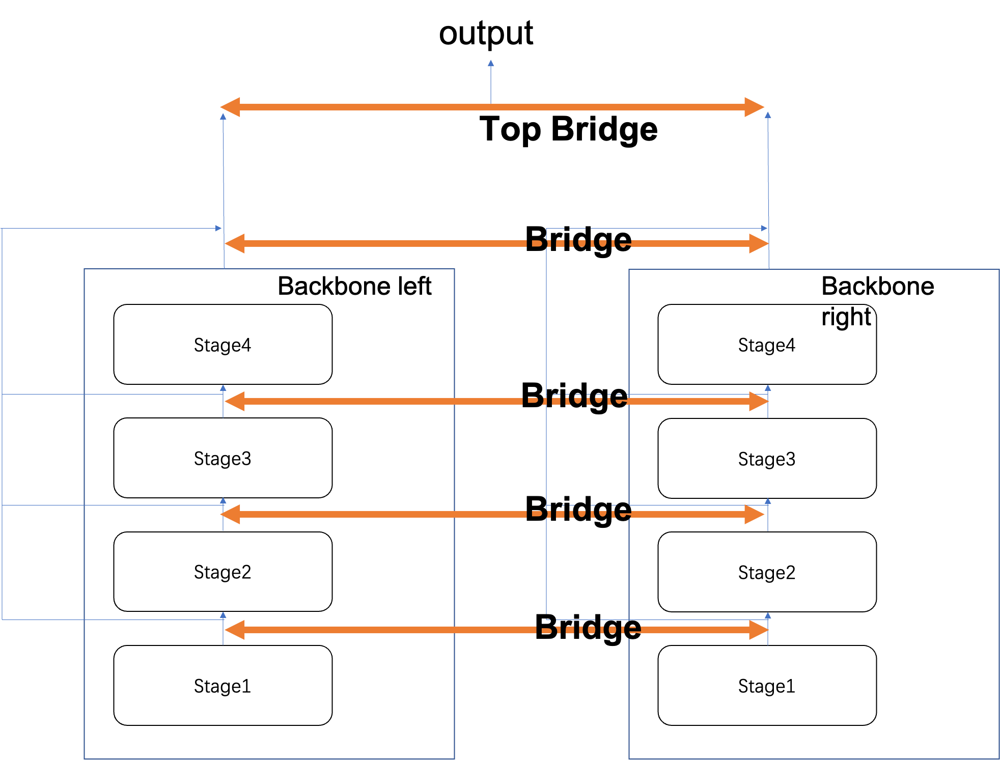

<div align="center">
  
</div>


## 介绍

RingMoMultimodal 是是空天院AI赛博试验室开发的应用于遥感领域的多模态工具集。

主分支代码目前支持 **PyTorch 1.6 以上**的版本。

<details open>
<summary><b>主要特性</b></summary>

- **灵眸大模型支持**

  RingMoMultimodal 支持空天灵眸大模型，并实现灵眸大模型权重分层次调用。

- **配置化设计**

  RingMoMultimodal 将多模态任务不同的模块组件，通过组合不同的模块组件。通过配置文件，可以实现多

- **多种类多模态任务支持**

  RingMoMultimodal 实现视觉定位跨模态任务。并涵盖了会将AI赛博试验室最新的多模态研究结果。

</details>

## 安装

RingMoMultimodal 依赖 [PyTorch](https://pytorch.org/), [MMCV](https://github.com/open-mmlab/mmcv) 、 [MMDetection](https://github.com/open-mmlab/mmdetection)，以下是安装的简要步骤。
更详细的安装指南请参考 [安装文档](https://mmrotate.readthedocs.io/zh_CN/latest/install.html)。

```shell
conda create -n ringmo-multimodal python=3.7 pytorch==1.7.0 cudatoolkit=10.1 torchvision -c pytorch -y
conda activate ringmo-multimodal
pip install openmim
mim install mmcv-full
mim install mmdet
min install mmrotate
pip install -r requirements/build.txt
pip install -v -e .
```

## 模型手册

### 总体结构
以多模态视觉定位的配置为例，其整体结构如图所示：

<div align="center">
  
</div>

多模态任务的主干网络由多个部分组成（如视觉主干网络和文本主干网络）。主干网络之间通过“桥接”的形式相联，可以实现主干网络的分层调用并交互。
最终，两个主干网络的输出作为主桥和输出头的输出。

### 分层调用示例

- 多模态主干网络（MultimodalBackbone）配置 
  多模态主干网络简易如下：
  ```python
   multimodal_backbone=dict(
        type="SimpleMultiModal",
        backbone_left={
            **ringmo1b['backbone'],
             "out_indices": [3]},
        backbone_right=dict(
            type="Bert",
            init_cfg=dict(
                bert_model="bert-base-uncased.tar.gz",
                tuned=False
            )
        ),
        top_bridge=dict(
            type="VLFBridge",
        ),
        bridges=[dict(type="xxx"), dict(type="xxx")]
  )
  ```

